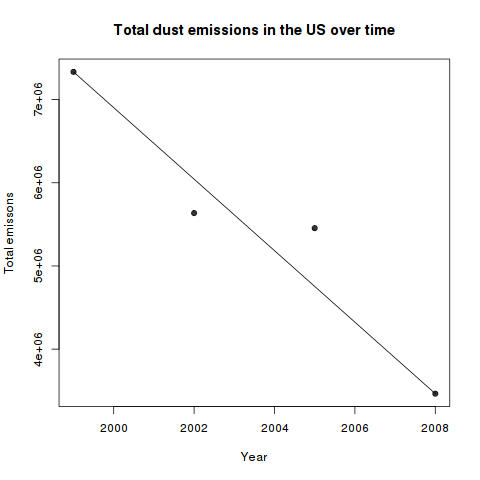
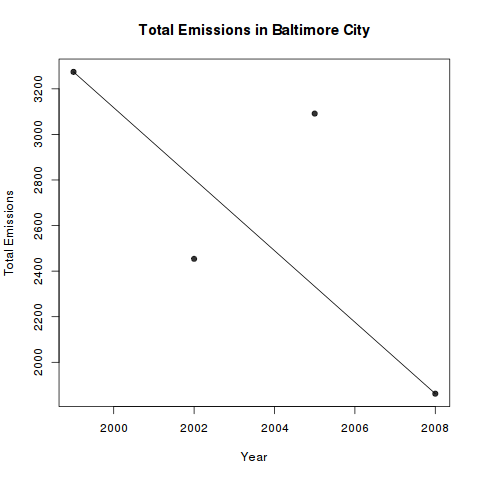

# Exploratory_week4
Solution to the project in week 4 of exploratory data analysis

# Task 1

Have the total emissions of pm2.5 decreased in the years 1999 to 2008?
Create plots of all emissions sources for the years 1999,2002,2005 and 2008.

It can be seen that the emissions decreased over the years

# Task 2

Have total emissions decreased in Baltimore City in the year 1999 to 2008?

Generally there is a clear trend that emissions decrease but with a outlier.

